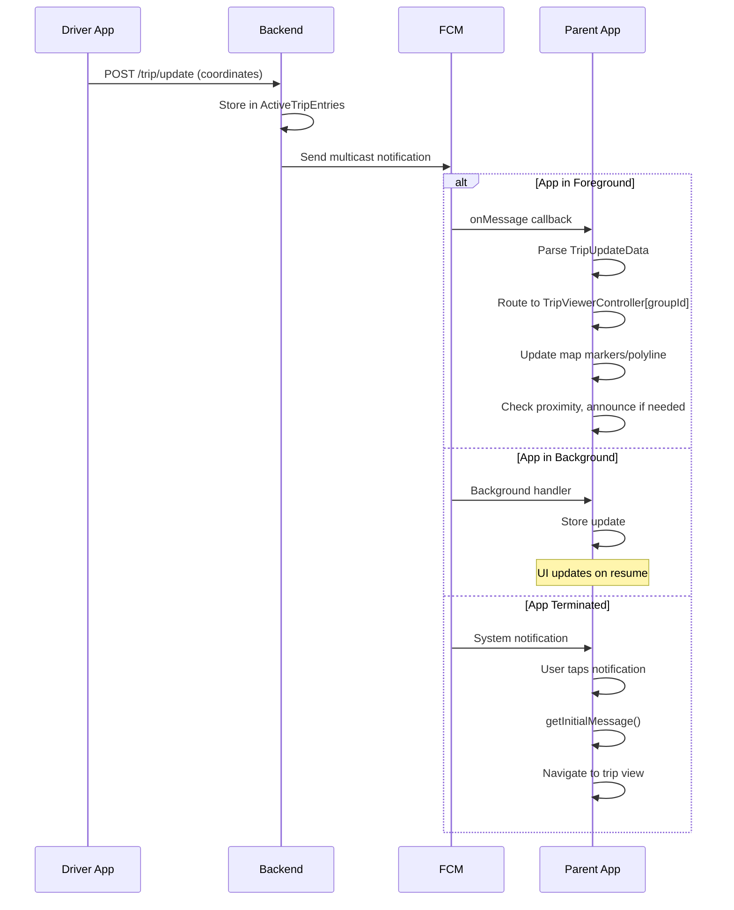
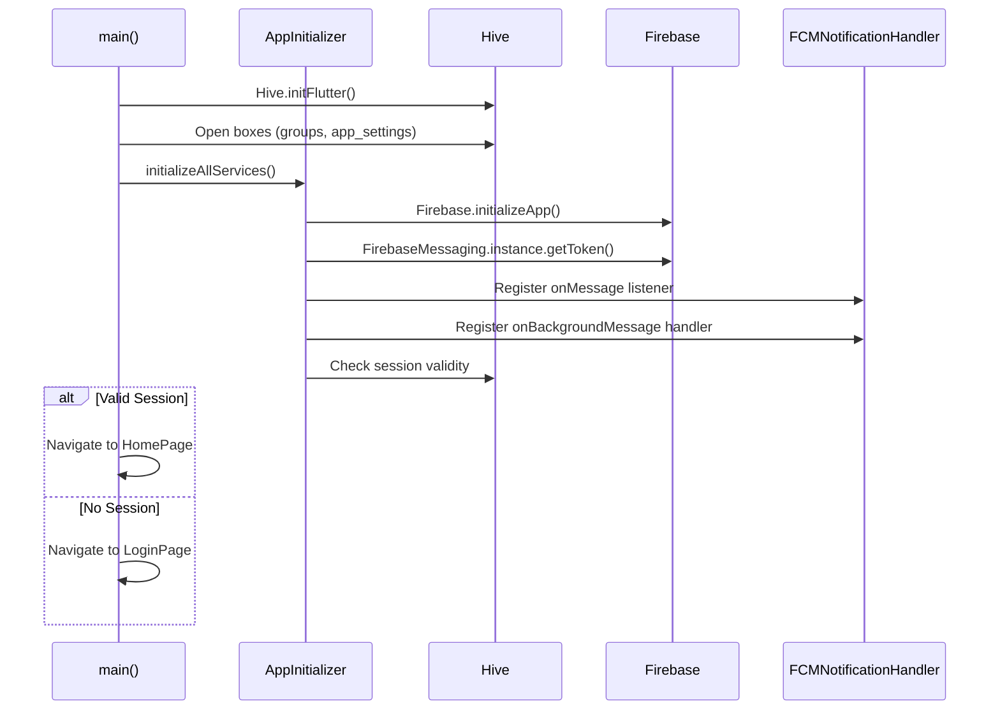

# Daari-Parent (Parent App) - Design Document

## Overview

Flutter-based Android application for parents to track school van location in real-time. Receives push notifications, displays live map, and provides dual proximity announcements (home + destination). Features include multi-group tracking, contact synchronization with smart permissions, user profile management with home address, comprehensive diagnostics with ZIP export, and 3-tier optimized trip loading (DES-TRP001).

## Phone Number Normalization Design (Proposed)

### Overview

Currently, both daari-c and daari-parent apps pass phone numbers from contacts as-is to the backend without any validation or normalization. This proposal adds client-side phone number normalization to ensure consistent formatting.

### Requirements

1. All phone numbers must be in format: `+91XXXXXXXXXX` (10 digits after +91)
2. If number is already in correct format, use as-is
3. Remove spaces ` ` and hyphens `-` from phone numbers
4. Apply normalization before sending to backend APIs

### Normalization Rules

| Input Format      | Transformation             | Output          |
| ----------------- | -------------------------- | --------------- |
| `9876543210`      | Add `+91` prefix           | `+919876543210` |
| `+919876543210`   | No change (already valid)  | `+919876543210` |
| `919876543210`    | Add `+` prefix             | `+919876543210` |
| `+91 98765 43210` | Remove spaces              | `+919876543210` |
| `+91-9876-543210` | Remove hyphens             | `+919876543210` |
| `098 7654 3210`   | Remove 0, spaces, add +91  | `+919876543210` |
| `0-98765-43210`   | Remove 0, hyphens, add +91 | `+919876543210` |

### Implementation Strategy

#### 1. Create Utility Class/Function

**Location (both apps):** `lib/utils/phone_number_utils.dart`

**Functionality:**

- `normalizePhoneNumber(String rawPhone) -> String`
  - Remove all spaces, hyphens, parentheses, and other non-numeric/non-+ characters
  - Detect and handle various formats
  - Validate final format (must be +91 followed by exactly 10 digits)
  - Throw exception or return error for invalid numbers

- `validatePhoneNumber(String normalizedPhone) -> bool`
  - Check if format matches `^\\+91\\d{10}$`
  - Return true/false

**Validation Rules:**

- After removing special chars, number should have 10, 11, 12, or 13 digits
- **10 digits starting with 6-9**: add `+91` prefix → `+91XXXXXXXXXX`
- **11 digits starting with `0`**: remove `0`, add `+91` → `+91XXXXXXXXXX`
- **11 digits (any other pattern)**: REJECT as invalid
- **12 digits starting with `91`**: add `+` prefix → `+91XXXXXXXXXX`
- **13 digits starting with `+91`**: validate format and use as-is
- **Any other format**: REJECT as invalid
- **Non-India country codes**: REJECT (only +91 allowed)
- **Final validation**: Must match regex `^\+91[6-9]\d{9}$`

#### 2. Integration Points

**A. Contact Selection (`SelectContactsPage`)**

- Normalize phone number immediately when contact is selected
- Display normalized number in UI for user verification
- Show validation error if number format is invalid
- User can still select, but warning displayed

**B. Group Creation (`GroupService.createGroup` / `BackendComService`)**

- Normalize all phone numbers before API call
- Filter out any invalid numbers (or block submission)
- Log normalization results for debugging

**C. Add Members (`AddMembersScreen` / `BackendComService.addGroupMembers`)**

- Normalize phone numbers before API submission
- Validate all numbers before sending request

**D. Remove Members (`RemoveMembersScreen`)**

- Normalize phone numbers for consistency in comparison

**E. Phone Number Comparisons**

- Update all `_normalizePhoneNumber()` helper methods in:
  - `screens/group_members_screen.dart`
  - `screens/remove_members_screen.dart`
- Use central utility instead of local regex

#### 3. UI/UX Considerations

**Display Format:**

- Store: `+919876543210`
- Display: `+919876543210` (same as stored, no special formatting needed)
- Hive storage will contain normalized format, display as-is

**Error Handling:**

- **Reject invalid numbers immediately** during contact selection
- Show clear error dialog/snackbar with specific reason:
  - "Invalid phone number format"
  - "Only Indian phone numbers (+91) are supported"
  - "Phone number must have 10 digits"
- Invalid contacts cannot be selected (grayed out or filtered)

**User Feedback:**

- Toast/snackbar showing "X members added" after normalization
- Show normalized format in contact list preview
- Clear error messages for validation failures with examples

#### 4. Backward Compatibility

**Hive Storage:**

- **No migration required** - new normalization applies to new data only
- All future phone numbers will be normalized before storage
- Existing phone numbers remain as-is (backend handles validation)

**API Responses:**

- Backend validates and may discard invalid phone numbers
- Backend continues with valid numbers only
- Client normalizes before sending, backend validates on receive
- Store phone numbers from backend responses in normalized format

#### 5. Testing Scenarios

| Test Case                  | Input             | Expected Output | Notes                         |
| -------------------------- | ----------------- | --------------- | ----------------------------- |
| Standard 10-digit          | `9876543210`      | `+919876543210` | Most common case              |
| With spaces                | `98765 43210`     | `+919876543210` | Common in contacts            |
| With hyphens               | `98765-43210`     | `+919876543210` | Common in contacts            |
| Leading zero               | `09876543210`     | `+919876543210` | Old format                    |
| Already normalized         | `+919876543210`   | `+919876543210` | No change                     |
| With 91 prefix             | `919876543210`    | `+919876543210` | Add + only                    |
| Mixed formatting           | `+91-98765 43210` | `+919876543210` | Complex cleanup               |
| Invalid length             | `98765`           | **REJECTED**    | Too short, show error         |
| Wrong country code         | `+1234567890`     | **REJECTED**    | Non-India number, show error  |
| 11 digits (non-zero start) | `91234567890`     | **REJECTED**    | Ambiguous format, show error  |
| Invalid starting digit     | `+915876543210`   | **REJECTED**    | Must start with 6-9 after +91 |

### Implementation Decisions (Finalized)

1. **Invalid Number Handling:** ✅ Reject immediately and show warning to user
2. **Non-India Numbers:** ✅ Do not allow (India-only, +91 enforced)
3. **Backend Compatibility:** ✅ Backend will validate and discard invalid numbers, continue with valid ones
4. **Migration Strategy:** ✅ No migration needed - applies to new data only
5. **Display Format:** ✅ Display as stored in Hive (normalized format)
6. **Numbers starting with 0:** ✅ Remove leading 0 and normalize to `+91XXXXXXXXXX`
7. **11-digit numbers:** ✅ Treat as invalid (except leading 0 case)

### Files to Modify (Both Apps)

**New Files:**

- `lib/utils/phone_number_utils.dart` (utility class)

**Existing Files to Update:**

- `lib/select_contacts_page.dart` - normalize on contact selection
- `lib/services/group_service.dart` - normalize before group creation
- `lib/services/backend_com_service.dart` - normalize before all API calls
- `lib/screens/add_members_screen.dart` - normalize before adding members
- `lib/screens/remove_members_screen.dart` - use centralized normalization
- `lib/screens/group_members_screen.dart` - use centralized normalization

### Logging and Monitoring

- Log all normalization attempts with before/after values
- Track normalization failures for analytics
- Add debug screen showing normalization statistics
- Include in diagnostics export for troubleshooting

## File Structure and Responsibilities

### Root Files

#### `lib/main.dart`

Application entry point with lifecycle management. Initializes all services via AppInitializer, sets up global singletons (storageService, tripViewerControllers registry), configures app lifecycle observers (WidgetsBindingObserver) for DES-GRP006 group refresh on app resume, and routes to LoginPage or HomePage based on session state.

#### `lib/constants.dart`

Application-wide constants including configuration values, API endpoints patterns, timing constants, and feature flags.

#### `lib/login_page.dart`

Phone number authentication UI. Handles OTP flow via Firebase Auth, location permission requests, backend URL configuration (ngrok support for dev), and FCM token registration after successful login.

#### `lib/home_page.dart`

Main dashboard showing list of groups the parent belongs to. Provides group creation, group selection to view trip details, diagnostic tools access, and logout functionality. Fetches and displays cached groups from Hive.

#### `lib/group_details_page.dart`

Per-group trip viewing screen with Google Maps integration. Displays real-time driver location, route polyline, trip status widget, and proximity-based announcements. Manages TripViewerController lifecycle for the group. Shows group members and provides group management options.

#### `lib/select_contacts_page.dart`

Contact picker with phone number validation. Filters device contacts, validates and normalizes phone numbers using PhoneNumberUtils, displays validation errors, and returns selected members as GroupMemberInput list for group creation.

#### `lib/route_service.dart`

Google Maps Directions API integration for route calculation. Fetches driving directions between two points, decodes polyline data, and provides route visualization data.

#### `lib/OtpService.dart`

Firebase phone authentication wrapper. Manages verification ID storage, OTP sending, verification, and error handling for phone-based login.

#### `lib/shared_preferences.dart`

User preferences and settings management (wrapper around shared_preferences package for app-specific settings).

### Controllers

#### `lib/controllers/trip_viewer_controller.dart`

State management for individual group trip viewing with DES-TRP001 3-tier loading. Maintains immutable TripViewingState, processes FCM trip updates (start/update/finish), handles trip lifecycle with wakelock management, manages dual proximity announcements (home + destination), coordinates map marker/polyline updates, implements 3-tier loading (in-memory → Hive → backend), and caches group destination and name for announcements.

### Models

#### `lib/models/group.dart` / `group.g.dart`

Hive model for Group entity. Contains group_id, group_name, destination coordinates, member phone numbers, admin/driver phone numbers, and isAdmin flag. Generated adapter for Hive storage.

#### `lib/models/group_member_input.dart`

Input model for creating group members. Contains name and phone number (normalized format) for API requests.

#### `lib/models/group_member_name.dart` / `group_member_name.g.dart`

Hive model (TypeId: 5) for contact sync. Maps phone numbers to contact names from device contacts, enabling display of names instead of phone numbers in group member lists. Used by ContactSyncService.

#### `lib/models/user_profile.dart` / `user_profile.g.dart`

Hive model (TypeId: 10) for user profile data. Stores profId, phoneNumber, firstName, lastName, email, and lastUpdated timestamp. Provides fullName getter and isComplete validation.

#### `lib/models/app_settings.dart` / `app_settings.g.dart`

Hive model (TypeId: 2) for app configuration. Stores backend URL, FCM token, user session data (idToken, profId, firstName, lastName, email), location permissions, and app-level preferences with generated adapter.

#### `lib/models/trip_settings.dart` / `trip_settings.g.dart`

Hive model (TypeId: 1) for trip configuration per group. Stores home location coordinates, notification preferences, announcement settings with generated adapter.

#### `lib/models/location_point.dart` / `location_point.g.dart`

Hive model (TypeId: 0) for cached location data. Stores latitude, longitude, timestamp for offline viewing with generated adapter.

#### `lib/models/trip_viewing_state.dart`

Immutable state class for trip visualization. Contains trip name, start location, route points list, start time, active status, and final location. Provides methods to create new instances with updated data (addPoint with eventType, finish with finalLocation).

#### `lib/models/trip_update_data.dart`

FCM payload parser for trip updates. Parses notification data into structured object with trip name, group ID, coordinates, event type (started/updated/finished), and timestamp.

#### `lib/models/trip_status_data.dart`

Calculated trip statistics for UI display. Contains elapsed time, distance from home, current speed, and ETA computed from real-time location data.

### Services

#### `lib/services/app_initializer.dart`

Centralized service initialization orchestrator. Initializes Firebase, Hive, FCM notification handlers, registers background message handler, and ensures proper startup sequence.

#### `lib/services/backend_com_service.dart`

HTTP client for backend API communication. Singleton service handling group creation, member management (add/remove), driver assignment, group fetching, and session management. Normalizes phone numbers before API calls.

#### `lib/services/group_service.dart`

Group management business logic. Handles group creation with Hive caching, member validation, and backend synchronization.

#### `lib/services/user_service.dart`

User-related operations including profile management, session handling, and user-specific settings.

#### `lib/services/location_storage_service.dart`

Hive-based data persistence layer. Manages groups box, app settings box, trip settings box, location cache, FCM token storage, and session management. Provides CRUD operations for all cached data.

#### `lib/services/fcm_service.dart`

Firebase Cloud Messaging setup and token management. Handles FCM token generation, registration with backend, token refresh, and permission requests.

#### `lib/services/fcm_service.dart`

Firebase Cloud Messaging token management. Handles FCM token generation, registration with backend, token refresh, permission requests, and DES-GRP006 integration for group refresh triggers.

#### `lib/services/fcm_notification_handler.dart`

FCM message processing pipeline. Routes messages to appropriate TripViewerController based on group_id, handles foreground/background/terminated states, manages notification channel creation, and implements DES-GRP006 group refresh on app resume.

#### `lib/services/notification_service.dart` (alias: `audio_notification_service.dart`)

Local notification display using flutter_local_notifications. Creates notification channels (tripStart, tripUpdate, tripEnd), shows notifications with appropriate priority and sound settings. Also includes background audio playback using just_audio for trip started/finished sounds.

#### `lib/services/announcement_service.dart`

Text-to-speech dual proximity announcements. Announces van distance at thresholds for both home (1km, 500m, 200m, 100m) and destination (1km, 500m, 200m, 100m, 50m reached), prevents duplicate announcements using flags, and handles TTS initialization and language settings.

#### `lib/services/contact_sync_service.dart`

Contact name synchronization with smart permission management. Syncs device contact names with group member phone numbers, stores in Hive (GroupMemberName model), reuses existing contact permission grants to avoid duplicate dialogs, handles permission denial gracefully, and provides match statistics.

#### `lib/services/profile_service.dart`

User profile management with caching. Fetches profile from backend, caches in Hive (UserProfile model), updates profile data (firstName, lastName, email), supports home address for proximity calculations, and provides profile completeness validation.

#### `lib/services/user_service.dart`

User-related operations and authentication state. Updates user home coordinates with address and place name, syncs to backend, manages authentication status checks, and retrieves current profile ID.

#### `lib/services/device_info_service.dart`

Device information collection for diagnostics and authentication (DES-AUTH001). Gathers device model, OS version, app version, platform, and device identifiers for troubleshooting and backend logging.

#### `lib/services/diagnostic_service.dart`

Diagnostic ZIP creation for troubleshooting. Collects Hive data (groups, settings sanitized without tokens), log files, device and app info, creates ZIP archive, and provides file for sharing with support.

### Screens

#### `lib/screens/group_members_screen.dart`

Group member list display with management options. Shows member roles (admin/driver/member), provides member addition, member removal, driver assignment, and group deletion dialogs. Uses PhoneNumberUtils for phone comparison.

#### `lib/screens/add_members_screen.dart`

Add members to existing group UI. Integrates SelectContactsPage, validates member count limits (max 20), and calls backend API to add members.

#### `lib/screens/remove_members_screen.dart`

Remove members from group UI. Multi-select interface for members, prevents removing admin/current user, validates selection, and calls backend API. Uses PhoneNumberUtils for member identification.

#### `lib/screens/delete_group_dialog.dart`

Confirmation dialog for group deletion with name verification. Shows warning, requires typing group name to confirm, and triggers group deletion with local cache cleanup.

#### `lib/screens/profile_page.dart`

User profile viewing and editing UI. Displays current profile (name, email, phone), allows editing first name, last name, and email with validation, shows confirmation dialog for changes, saves to backend and Hive cache, and provides home address management.

#### `lib/screens/log_viewer_screen.dart`

In-app log viewer for debugging. Displays application logs with filtering by level (DEBUG, INFO, WARNING, ERROR), shows file list sorted by date, allows sharing logs, supports clearing all logs, and provides real-time log viewing.

### Utilities

#### `lib/utils/app_logger.dart`

Centralized logging utility. Provides structured logging with levels (debug, info, warning, error), log file management, and in-memory log buffer for diagnostics.

#### `lib/utils/phone_number_utils.dart`

Phone number validation and normalization. Handles format detection (10/11/12/13 digits), normalizes to +91XXXXXXXXXX format, validates against regex `^\+91[6-9]\d{9}$`, and provides error messages for UI feedback.

#### `lib/utils/distance_calculator.dart`

Geographic distance calculations using Haversine formula. Computes distances between coordinates for proximity detection and trip statistics.

### Widgets

#### `lib/widgets/status_widget.dart`

Global status message display. Shows toast/snackbar messages for success, error, info, and warning with color-coded styling.

#### `lib/widgets/search_place_widget.dart`

Google Places autocomplete widget. Integrates Google Places API for destination search with suggestions and selection handling.

#### `lib/widgets/trip_control_buttons.dart`

Trip viewing control buttons (refresh, center map, etc.). Provides UI controls for trip visualization screen.

#### `lib/widgets/trip_status_widget.dart`

Trip statistics display card. Shows elapsed time, distance from home, current speed, and ETA in formatted layout.

#### `lib/widgets/route_info_card.dart`

Route information display. Shows route details, distance, duration, and destination information.

#### `lib/widgets/map_utility_buttons.dart`

Map view utility buttons. Provides zoom controls, map type toggle, and location centering.

### Map Service

#### `lib/map_srvc/gmaps_service.dart`

Google Maps API integration service. Handles Places API calls, autocomplete suggestions, place details retrieval, and geocoding operations.

#### `lib/map_srvc/models/place_prediction.dart`

Place autocomplete prediction model. Represents Google Places autocomplete suggestion with place_id, description, and structured formatting.

#### `lib/map_srvc/models/place_coordinates.dart`

Place coordinates model. Contains latitude, longitude, and optional place metadata from Places API responses.

## Architecture

```
┌─────────────────────────────────────────────────────────────────────┐
│                           UI Layer                                  │
│  ┌──────────────┐  ┌──────────────┐  ┌──────────────────────────┐  │
│  │  LoginPage   │  │   HomePage   │  │   GroupDetailsPage       │  │
│  └──────────────┘  └──────────────┘  └──────────────────────────┘  │
└─────────────────────────────────────────────────────────────────────┘
                                │
                                ▼
┌─────────────────────────────────────────────────────────────────────┐
│                        Controller Layer                             │
│  ┌─────────────────────────────────────────────────────────────┐   │
│  │              TripViewerController (per group)                │   │
│  │   tripViewerControllers: Map<int, TripViewerController>     │   │
│  └─────────────────────────────────────────────────────────────┘   │
└─────────────────────────────────────────────────────────────────────┘
                                │
                                ▼
┌─────────────────────────────────────────────────────────────────────┐
│                        Service Layer                                │
│  ┌─────────────────────┐  ┌─────────────────────────────────────┐  │
│  │  BackendComService  │  │     LocationStorageService          │  │
│  └─────────────────────┘  └─────────────────────────────────────┘  │
│  ┌─────────────────────┐  ┌─────────────────────────────────────┐  │
│  │FCMNotificationHandler│  │     AnnouncementService            │  │
│  └─────────────────────┘  └─────────────────────────────────────┘  │
└─────────────────────────────────────────────────────────────────────┘
                │                               │
                ▼                               ▼
┌─────────────────────────┐       ┌─────────────────────────┐
│  Firebase Cloud         │       │    Text-to-Speech       │
│  Messaging (FCM)        │       │    (flutter_tts)        │
└─────────────────────────┘       └─────────────────────────┘
```

## Key Design Decisions

### 1. Per-Group TripViewerController Registry

Each group has its own controller instance for independent state management:

```dart
// Global registry in main.dart
Map<int, TripViewerController> tripViewerControllers = {};

// Access pattern
TripViewerController getOrCreateController(int groupId) {
  return tripViewerControllers.putIfAbsent(
    groupId,
    () => TripViewerController(groupId: groupId),
  );
}
```

**Why**:

- Parent may have children in multiple groups (schools)
- Each group's trip tracked independently
- FCM messages routed to correct controller by group_id

```
┌─────────────────────────────────────────────────────────────┐
│           Multi-Group Trip Tracking                         │
├─────────────────────────────────────────────────────────────┤
│                                                             │
│  tripViewerControllers (Map)                                │
│  ├── groupId: 5  ──▶ TripViewerController                  │
│  │                   └── Trip: "trip_5_12_1705..."         │
│  │                   └── State: ACTIVE                     │
│  │                                                         │
│  ├── groupId: 8  ──▶ TripViewerController                  │
│  │                   └── Trip: null                        │
│  │                   └── State: IDLE                       │
│  │                                                         │
│  └── groupId: 12 ──▶ TripViewerController                  │
│                      └── Trip: "trip_12_7_1705..."         │
│                      └── State: ACTIVE                     │
│                                                             │
└─────────────────────────────────────────────────────────────┘
```

### 2. Immutable Trip State Pattern

`TripViewingState` is immutable - updates create new instances:

```dart
class TripViewingState {
  final String? tripName;
  final LatLng? startLocation;
  final List<LatLng> points;
  final DateTime? startTime;
  final bool isTripActive;

  // Returns NEW instance with point added
  TripViewingState addPoint(LatLng point) {
    return TripViewingState(
      tripName: tripName,
      startLocation: startLocation,
      points: [...points, point],  // New list
      startTime: startTime,
      isTripActive: isTripActive,
    );
  }
}
```

**Why**:

- Predictable state changes
- No accidental mutations
- Easier debugging (can log state transitions)
- Works well with Flutter's rebuild model

### 3. FCM Message Handling Strategy

```
┌─────────────────────────────────────────────────────────────┐
│             FCM Message Processing Pipeline                  │
├─────────────────────────────────────────────────────────────┤
│                                                             │
│  ┌─────────────────────────────────────────────────────┐   │
│  │              Message Types                           │   │
│  ├─────────────────────────────────────────────────────┤   │
│  │ trip_started  │ Visible notification + sound        │   │
│  │ trip_updated  │ Silent (data only)                  │   │
│  │ trip_finished │ Visible notification, no sound      │   │
│  └─────────────────────────────────────────────────────┘   │
│                                                             │
│  ┌─────────────────────────────────────────────────────┐   │
│  │           App States                                 │   │
│  ├─────────────────────────────────────────────────────┤   │
│  │                                                     │   │
│  │  FOREGROUND:                                        │   │
│  │  ├── onMessage listener fires                       │   │
│  │  ├── Parse TripUpdateData from payload              │   │
│  │  ├── Route to TripViewerController[group_id]        │   │
│  │  ├── Update map UI immediately                      │   │
│  │  └── Show local notification (optional)             │   │
│  │                                                     │   │
│  │  BACKGROUND:                                        │   │
│  │  ├── firebaseMessagingBackgroundHandler()          │   │
│  │  ├── System shows notification                      │   │
│  │  └── State updated when app resumes                 │   │
│  │                                                     │   │
│  │  TERMINATED:                                        │   │
│  │  ├── System shows notification                      │   │
│  │  ├── Tap opens app                                  │   │
│  │  ├── getInitialMessage() retrieves data            │   │
│  │  └── Navigate to correct group                      │   │
│  │                                                     │   │
│  └─────────────────────────────────────────────────────┘   │
│                                                             │
└─────────────────────────────────────────────────────────────┘
```

### 4. Dual Proximity Announcement System

Audio alerts when van approaches both home location AND destination (school):

```
┌─────────────────────────────────────────────────────────────┐
│         Dual Proximity Detection Logic                      │
├─────────────────────────────────────────────────────────────┤
│                                                             │
│  A. HOME PROXIMITY                                          │
│  Distance from Home         Announcement                    │
│  ─────────────────         ────────────────                │
│  > 1000m                   (none)                          │
│  ≤ 1000m                   "Van is 1 kilometer away"       │
│  ≤ 500m                    "Van is 500 meters away"        │
│  ≤ 200m                    "Van is 200 meters away"        │
│  ≤ 100m                    "Van is arriving"               │
│                                                             │
│  Flags to prevent repeat:                                   │
│  ├── _announced1km: bool                                   │
│  ├── _announced500m: bool                                  │
│  ├── _announced200m: bool                                  │
│  └── _announced100m: bool                                  │
│                                                             │
│  B. DESTINATION PROXIMITY                                   │
│  Distance from Destination  Announcement                    │
│  ─────────────────────────  ────────────────                │
│  > 1000m                    (none)                         │
│  ≤ 1000m                    "Van approaching destination"  │
│  ≤ 500m                     "Van near destination"         │
│  ≤ 200m                     "Van close to destination"     │
│  ≤ 100m                     "Van arriving at destination"  │
│  ≤ 50m                      "Van has reached destination"  │
│                                                             │
│  Flags to prevent repeat:                                   │
│  ├── _announcedDest1km: bool                               │
│  ├── _announcedDest500m: bool                              │
│  ├── _announcedDest200m: bool                              │
│  ├── _announcedDest100m: bool                              │
│  └── _announcedDestReached: bool                           │
│                                                             │
│  Reset ALL flags on trip finish                             │
│                                                             │
└─────────────────────────────────────────────────────────────┘
```

**Implementation**:

```dart
// Home proximity
void _checkProximityToHome(double lat, double lng) {
  final homeCoords = _getHomeCoordinates();
  if (homeCoords == null) return;

  final distance = DistanceCalculator.calculateDistance(
    lat, lng, homeCoords.latitude, homeCoords.longitude,
  );

  if (distance <= 100 && !_announced100m) {
    _announced100m = true;
    announcementService.announce("Van is arriving");
  } else if (distance <= 200 && !_announced200m) {
    _announced200m = true;
    announcementService.announce("Van is 200 meters away");
  }
  // ... similar for 500m and 1km
}

// Destination proximity
Future<void> _checkProximityToDestination(double lat, double lng) async {
  final destCoords = await _getGroupDestination();
  if (destCoords == null) return;

  final distance = DistanceCalculator.calculateDistance(
    lat, lng, destCoords.latitude, destCoords.longitude,
  );

  if (distance <= 50 && !_announcedDestReached) {
    _announcedDestReached = true;
    announcementService.announce("Van has reached destination");
  } else if (distance <= 100 && !_announcedDest100m) {
    _announcedDest100m = true;
    announcementService.announce("Van arriving at destination");
  }
  // ... similar for 200m, 500m, 1km
}
```

### 5. FCM Notification Channels (Android)

```
┌─────────────────────────────────────────────────────────────┐
│            Android Notification Channels                     │
├─────────────────────────────────────────────────────────────┤
│                                                             │
│  Channel ID       │ Importance │ Sound │ Purpose            │
│  ─────────────────┼────────────┼───────┼──────────────────  │
│  tripStart        │ HIGH       │ Yes   │ Trip started alert │
│  tripUpdate       │ LOW        │ No    │ Silent UI updates  │
│  tripEnd          │ DEFAULT    │ No    │ Trip finished      │
│                                                             │
│  Note: Channels created at app startup via                  │
│  FlutterLocalNotificationsPlugin                           │
│                                                             │
└─────────────────────────────────────────────────────────────┘
```

### 6. Contact Sync Service with Smart Permissions

Automatically syncs device contact names with group member phone numbers for better UX:

**Smart Permission Strategy**:

```dart
Future<bool> requestPermission() async {
  // Check if already granted (e.g., from SelectContactsPage)
  PermissionStatus status = await Permission.contacts.status;

  if (status.isGranted) {
    logger.info('[CONTACTS] Permission already granted (reusing existing)');
    return true; // ✅ No dialog shown - already granted!
  }

  // Only request if not yet granted
  if (status.isDenied) {
    status = await Permission.contacts.request();
  }

  return status.isGranted;
}
```

**How It Works**:

1. User selects contacts in `SelectContactsPage` during group creation → grants contact permission
2. Later, app needs to sync contact names for group members → `ContactSyncService` checks permission
3. If already granted, proceeds without showing dialog again (smart reuse)
4. Only requests permission if not yet granted or permanently denied
5. Gracefully handles permanent denial → shows phone numbers instead of names

**Data Flow**:

```
┌─────────────────────────────────────────────────────────────┐
│              Contact Sync Process                            │
├─────────────────────────────────────────────────────────────┤
│                                                             │
│  1. Group loaded from backend                               │
│     └── Contains member phone numbers (normalized)          │
│                                                             │
│  2. ContactSyncService.syncContactsForGroups([group])       │
│     ├── Check/request contacts permission (smart)           │
│     ├── Read all device contacts                            │
│     └── Match phone numbers (after normalization)           │
│                                                             │
│  3. Store matches in Hive                                   │
│     └── GroupMemberName(phone, contactName) [TypeId: 5]     │
│                                                             │
│  4. UI displays contact names instead of phone numbers      │
│     └── Fallback to phone number if no match               │
│                                                             │
└─────────────────────────────────────────────────────────────┘
```

**Benefits**:

- No duplicate permission dialogs (reuses grants)
- Better UX with names instead of phone numbers
- Graceful degradation if permission denied
- Automatic re-sync when groups change

## Data Flow: Trip Notification



## TripViewerController State Machine

```
┌───────────────────────────────────────────────────────────────────┐
│                TripViewerController States                         │
├───────────────────────────────────────────────────────────────────┤
│                                                                   │
│  State: TripViewingState (immutable)                              │
│  ├── tripName: String?                                           │
│  ├── startLocation: LatLng?                                      │
│  ├── points: List<LatLng>                                        │
│  ├── startTime: DateTime?                                        │
│  └── isTripActive: bool                                          │
│                                                                   │
│                                                                   │
│            ┌─────────────────────┐                               │
│            │       IDLE          │                               │
│            │ isTripActive=false  │                               │
│            │ points=[]           │                               │
│            └──────────┬──────────┘                               │
│                       │                                          │
│                       │ FCM: trip_started                        │
│                       │ handleTripStart()                        │
│                       ▼                                          │
│            ┌─────────────────────┐                               │
│            │     VIEWING         │                               │
│            │ isTripActive=true   │◄─────────────────┐            │
│            │ points=[start, ...] │                  │            │
│            └──────────┬──────────┘                  │            │
│                       │                             │            │
│                       │ FCM: trip_updated           │            │
│                       │ handleTripUpdate()          │            │
│                       │ state = state.addPoint()    │            │
│                       └─────────────────────────────┘            │
│                       │                                          │
│                       │ FCM: trip_finished                       │
│                       │ handleTripFinished()                     │
│                       ▼                                          │
│            ┌─────────────────────┐                               │
│            │     FINISHED        │                               │
│            │ Show completion UI  │                               │
│            │ Reset state         │                               │
│            └──────────┬──────────┘                               │
│                       │                                          │
│                       ▼                                          │
│            ┌─────────────────────┐                               │
│            │       IDLE          │                               │
│            └─────────────────────┘                               │
│                                                                   │
└───────────────────────────────────────────────────────────────────┘
```

## FCM Payload Structure

```json
{
  "notification": {
    "title": "Trip Update",
    "body": "School Group A - Van is on the way"
  },
  "data": {
    "type": "trip_started | trip_updated | trip_finished",
    "trip_name": "trip_5_12_1705312200",
    "group_id": "5",
    "group_name": "School Group A",
    "latitude": "28.6139",
    "longitude": "77.2090",
    "timestamp": "2025-01-15T10:30:00Z"
  }
}
```

**Parsing**:

```dart
class TripUpdateData {
  factory TripUpdateData.fromFCM(Map<String, dynamic> data) {
    return TripUpdateData(
      tripName: data['trip_name'],
      groupId: int.parse(data['group_id']),
      latitude: double.parse(data['latitude']),
      longitude: double.parse(data['longitude']),
      eventType: data['type'],
      timestamp: DateTime.parse(data['timestamp']),
      groupName: data['group_name'],
    );
  }
}
```

## Map Visualization

```
┌─────────────────────────────────────────────────────────────┐
│                     Map Elements                            │
├─────────────────────────────────────────────────────────────┤
│                                                             │
│  Markers:                                                   │
│  ┌─────────────────────────────────────────────────────┐   │
│  │ [🟢] Green  - Trip start location                   │   │
│  │ [🔴] Red    - Current driver location (animated)    │   │
│  │ [🔵] Blue   - Destination (school)                  │   │
│  │ [🏠] Custom - Child's home (if set)                 │   │
│  └─────────────────────────────────────────────────────┘   │
│                                                             │
│  Polylines:                                                 │
│  ┌─────────────────────────────────────────────────────┐   │
│  │ Blue line showing driver's route                    │   │
│  │ Connects all points in TripViewingState.points      │   │
│  └─────────────────────────────────────────────────────┘   │
│                                                             │
│  Camera Behavior:                                           │
│  ┌─────────────────────────────────────────────────────┐   │
│  │ Auto-follows driver location during active trip     │   │
│  │ Zoom level maintained by user                       │   │
│  │ Smooth animation via CameraUpdate.newLatLng()       │   │
│  └─────────────────────────────────────────────────────┘   │
│                                                             │
└─────────────────────────────────────────────────────────────┘
```

## Trip Status Display

```
┌─────────────────────────────────────────────────────────────┐
│              Status Widget Information                       │
├─────────────────────────────────────────────────────────────┤
│                                                             │
│  TripStatusData:                                            │
│  ├── Elapsed Time: "00:15:32"                              │
│  ├── Distance from Home: "1.2 km"                          │
│  ├── Current Speed: "25 km/h" (calculated)                 │
│  └── ETA: "~3 min" (estimated)                             │
│                                                             │
│  Calculated from:                                           │
│  ├── startTime vs now → elapsed                            │
│  ├── Geolocator.distanceBetween() → distance               │
│  ├── distance / time → speed                               │
│  └── distance / speed → ETA                                │
│                                                             │
└─────────────────────────────────────────────────────────────┘
```

## Error Handling

| Error                      | Detection          | Action                             |
| -------------------------- | ------------------ | ---------------------------------- |
| FCM token invalid          | Registration error | Re-register token with backend     |
| Group not found            | 404 from backend   | Refresh groups list                |
| Location permission denied | Permission error   | Show rationale dialog              |
| Network unavailable        | SocketException    | Show cached data, retry on restore |
| TTS unavailable            | PlatformException  | Disable announcements, log warning |

## App Initialization Sequence



## Design Patterns & Specifications

### DES-TRP001: 3-Tier Trip Loading Optimization

**Strategy**: Load active trip data with progressive fallback for optimal performance.

**Tiers:**

1. **Tier 1 - In-Memory Check** (0ms): Return immediately if trip already loaded in `_viewingState.isTripActive`
2. **Tier 2 - Hive Cache** (<50ms): Load from local storage with freshness validation
3. **Tier 3 - Backend API** (<500ms): Fetch from backend if cache stale/missing

**Implementation:**

```dart
Future<void> loadActiveTrip() async {
  // Tier 1: In-memory
  if (_viewingState.isTripActive) {
    logger.debug('[DES-TRP001] Tier 1: In-memory hit');
    return;
  }

  // Tier 2: Hive cache
  final cachedTrip = await _storageService.getActiveTripForGroup(groupId);
  if (cachedTrip != null && cachedTrip.isFresh) {
    logger.debug('[DES-TRP001] Tier 2: Hive cache hit');
    _viewingState = cachedTrip.toViewingState();
    return;
  }

  // Tier 3: Backend API
  logger.debug('[DES-TRP001] Tier 3: Backend fetch');
  final apiTrip = await BackendComService.instance.fetchActiveTrip(groupId);
  if (apiTrip != null) {
    _viewingState = apiTrip.toViewingState();
    await _storageService.cacheTrip(apiTrip);
  }
}
```

### DES-GRP006: Group Refresh on App Resume

**Strategy**: Detect group membership changes via FCM and refresh on app resume.

**Flow:**

1. Backend sends `group_refresh` FCM message when group membership changes
2. App stores pending refresh flag in FCMNotificationHandler
3. App lifecycle observer detects app resume (`didChangeAppLifecycleState`)
4. On resume, check pending flag and trigger group refresh from backend
5. Sync all groups to Hive storage

**Implementation:**

```dart
// In main.dart
@override
void didChangeAppLifecycleState(AppLifecycleState state) {
  if (state == AppLifecycleState.resumed) {
    logger.debug('[DES-GRP006] App resumed - checking for group refresh');
    FCMNotificationHandler.checkPendingGroupRefresh();
  }
}

// In FCMNotificationHandler
static void checkPendingGroupRefresh() async {
  if (_pendingGroupRefresh) {
    _pendingGroupRefresh = false;
    await BackendComService.instance.refreshAllGroups();
  }
}
```

### DES-AUTH001: Device Info Collection

**Purpose**: Send device and app information during login for backend tracking and diagnostics.

**Data Collected:**

- App version (from package_info_plus)
- Phone model (from device_info_plus)
- OS version (Android API level)
- Platform ("android")

**Usage**: Included in login request body to `/auth/login` endpoint.

## Hive TypeIds Reference

All Hive models must have unique TypeIds to avoid conflicts. Current assignments:

| TypeId | Model           | File                   | Purpose                         |
| ------ | --------------- | ---------------------- | ------------------------------- |
| 0      | LocationPoint   | location_point.dart    | Cached location data for trips  |
| 1      | TripSettings    | trip_settings.dart     | Per-group trip configuration    |
| 2      | AppSettings     | app_settings.dart      | App-level settings and session  |
| 3      | Group           | group.dart             | Group entity with destination   |
| 5      | GroupMemberName | group_member_name.dart | Contact sync phone→name mapping |
| 10     | UserProfile     | user_profile.dart      | User profile with home address  |

**Important**: TypeIds 4, 6-9 are reserved for future use. Always check existing TypeIds before adding new models to avoid conflicts.

## Dependencies

| Package                       | Purpose                          |
| ----------------------------- | -------------------------------- |
| `firebase_auth`               | Phone OTP authentication         |
| `firebase_messaging`          | Push notifications (FCM)         |
| `google_maps_flutter`         | Map visualization                |
| `geolocator`                  | Distance calculations            |
| `hive` / `hive_flutter`       | Local caching and persistence    |
| `flutter_tts`                 | Text-to-speech announcements     |
| `flutter_local_notifications` | Local notification display       |
| `flutter_contacts`            | Contact access with permissions  |
| `permission_handler`          | Smart permission management      |
| `just_audio`                  | Background audio playback        |
| `wakelock_plus`               | Keep screen on during trips      |
| `device_info_plus`            | Device information (DES-AUTH001) |
| `package_info_plus`           | App version info                 |
| `archive`                     | ZIP creation for diagnostics     |
| `share_plus`                  | Share logs and diagnostics       |
| `url_launcher`                | Launch phone calls, links        |

## Key Differences from Driver App

| Aspect             | Driver App            | Parent App                     |
| ------------------ | --------------------- | ------------------------------ |
| Location tracking  | Active (GPS)          | Passive (FCM)                  |
| Trip control       | Start/Update/Finish   | View only                      |
| Background service | Yes (location)        | No (FCM only)                  |
| Notifications      | Sends via backend     | Receives via FCM               |
| Multi-group trips  | One at a time         | View multiple simultaneously   |
| Announcements      | None                  | Dual proximity TTS (home+dest) |
| Contact sync       | No                    | Yes (smart permissions)        |
| Profile management | No                    | Yes (with home address)        |
| Diagnostics        | Basic logging         | Full ZIP export                |
| Wakelock           | Always on during trip | On during trip, off on finish  |
| DES-TRP001 loading | Not applicable        | 3-tier optimization            |
