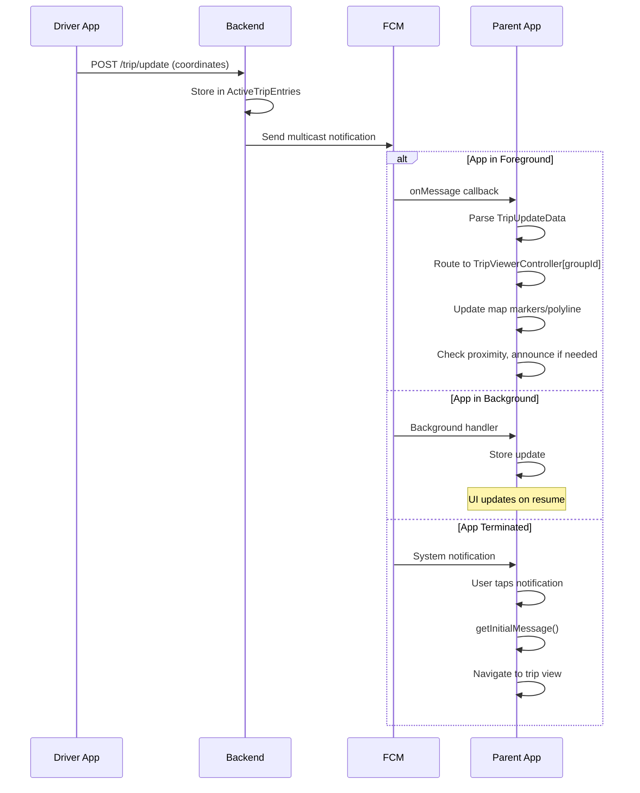
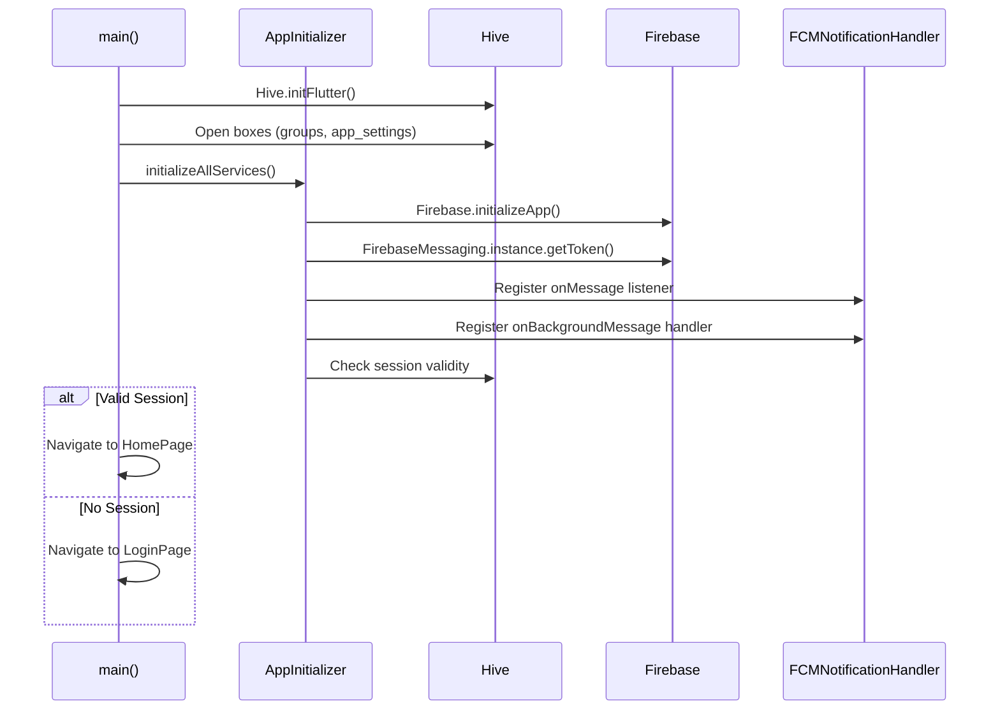

# Daari-Parent (Parent App) - Design Document

## Overview

Flutter-based Android application for parents to track school van location in real-time. Receives push notifications, displays live map, and provides proximity announcements.

## Architecture

```
┌─────────────────────────────────────────────────────────────────────┐
│                           UI Layer                                  │
│  ┌──────────────┐  ┌──────────────┐  ┌──────────────────────────┐  │
│  │  LoginPage   │  │   HomePage   │  │   GroupDetailsPage       │  │
│  └──────────────┘  └──────────────┘  └──────────────────────────┘  │
└─────────────────────────────────────────────────────────────────────┘
                                │
                                ▼
┌─────────────────────────────────────────────────────────────────────┐
│                        Controller Layer                             │
│  ┌─────────────────────────────────────────────────────────────┐   │
│  │              TripViewerController (per group)                │   │
│  │   tripViewerControllers: Map<int, TripViewerController>     │   │
│  └─────────────────────────────────────────────────────────────┘   │
└─────────────────────────────────────────────────────────────────────┘
                                │
                                ▼
┌─────────────────────────────────────────────────────────────────────┐
│                        Service Layer                                │
│  ┌─────────────────────┐  ┌─────────────────────────────────────┐  │
│  │  BackendComService  │  │     LocationStorageService          │  │
│  └─────────────────────┘  └─────────────────────────────────────┘  │
│  ┌─────────────────────┐  ┌─────────────────────────────────────┐  │
│  │FCMNotificationHandler│  │     AnnouncementService            │  │
│  └─────────────────────┘  └─────────────────────────────────────┘  │
└─────────────────────────────────────────────────────────────────────┘
                │                               │
                ▼                               ▼
┌─────────────────────────┐       ┌─────────────────────────┐
│  Firebase Cloud         │       │    Text-to-Speech       │
│  Messaging (FCM)        │       │    (flutter_tts)        │
└─────────────────────────┘       └─────────────────────────┘
```

## Key Design Decisions

### 1. Per-Group TripViewerController Registry

Each group has its own controller instance for independent state management:

```dart
// Global registry in main.dart
Map<int, TripViewerController> tripViewerControllers = {};

// Access pattern
TripViewerController getOrCreateController(int groupId) {
  return tripViewerControllers.putIfAbsent(
    groupId,
    () => TripViewerController(groupId: groupId),
  );
}
```

**Why**:
- Parent may have children in multiple groups (schools)
- Each group's trip tracked independently
- FCM messages routed to correct controller by group_id

```
┌─────────────────────────────────────────────────────────────┐
│           Multi-Group Trip Tracking                         │
├─────────────────────────────────────────────────────────────┤
│                                                             │
│  tripViewerControllers (Map)                                │
│  ├── groupId: 5  ──▶ TripViewerController                  │
│  │                   └── Trip: "trip_5_12_1705..."         │
│  │                   └── State: ACTIVE                     │
│  │                                                         │
│  ├── groupId: 8  ──▶ TripViewerController                  │
│  │                   └── Trip: null                        │
│  │                   └── State: IDLE                       │
│  │                                                         │
│  └── groupId: 12 ──▶ TripViewerController                  │
│                      └── Trip: "trip_12_7_1705..."         │
│                      └── State: ACTIVE                     │
│                                                             │
└─────────────────────────────────────────────────────────────┘
```

### 2. Immutable Trip State Pattern

`TripViewingState` is immutable - updates create new instances:

```dart
class TripViewingState {
  final String? tripName;
  final LatLng? startLocation;
  final List<LatLng> points;
  final DateTime? startTime;
  final bool isTripActive;

  // Returns NEW instance with point added
  TripViewingState addPoint(LatLng point) {
    return TripViewingState(
      tripName: tripName,
      startLocation: startLocation,
      points: [...points, point],  // New list
      startTime: startTime,
      isTripActive: isTripActive,
    );
  }
}
```

**Why**:
- Predictable state changes
- No accidental mutations
- Easier debugging (can log state transitions)
- Works well with Flutter's rebuild model

### 3. FCM Message Handling Strategy

```
┌─────────────────────────────────────────────────────────────┐
│             FCM Message Processing Pipeline                  │
├─────────────────────────────────────────────────────────────┤
│                                                             │
│  ┌─────────────────────────────────────────────────────┐   │
│  │              Message Types                           │   │
│  ├─────────────────────────────────────────────────────┤   │
│  │ trip_started  │ Visible notification + sound        │   │
│  │ trip_updated  │ Silent (data only)                  │   │
│  │ trip_finished │ Visible notification, no sound      │   │
│  └─────────────────────────────────────────────────────┘   │
│                                                             │
│  ┌─────────────────────────────────────────────────────┐   │
│  │           App States                                 │   │
│  ├─────────────────────────────────────────────────────┤   │
│  │                                                     │   │
│  │  FOREGROUND:                                        │   │
│  │  ├── onMessage listener fires                       │   │
│  │  ├── Parse TripUpdateData from payload              │   │
│  │  ├── Route to TripViewerController[group_id]        │   │
│  │  ├── Update map UI immediately                      │   │
│  │  └── Show local notification (optional)             │   │
│  │                                                     │   │
│  │  BACKGROUND:                                        │   │
│  │  ├── firebaseMessagingBackgroundHandler()          │   │
│  │  ├── System shows notification                      │   │
│  │  └── State updated when app resumes                 │   │
│  │                                                     │   │
│  │  TERMINATED:                                        │   │
│  │  ├── System shows notification                      │   │
│  │  ├── Tap opens app                                  │   │
│  │  ├── getInitialMessage() retrieves data            │   │
│  │  └── Navigate to correct group                      │   │
│  │                                                     │   │
│  └─────────────────────────────────────────────────────┘   │
│                                                             │
└─────────────────────────────────────────────────────────────┘
```

### 4. Proximity Announcement System

Audio alerts when van approaches home:

```
┌─────────────────────────────────────────────────────────────┐
│              Proximity Detection Logic                       │
├─────────────────────────────────────────────────────────────┤
│                                                             │
│  Distance from Home         Announcement                    │
│  ─────────────────         ────────────────                │
│  > 1000m                   (none)                          │
│  ≤ 1000m                   "Van is 1 kilometer away"       │
│  ≤ 500m                    "Van is 500 meters away"        │
│  ≤ 200m                    "Van is 200 meters away"        │
│  ≤ 100m                    "Van is arriving"               │
│                                                             │
│  Flags to prevent repeat:                                   │
│  ├── _announced1km: bool                                   │
│  ├── _announced500m: bool                                  │
│  ├── _announced200m: bool                                  │
│  └── _announced100m: bool                                  │
│                                                             │
│  Reset on trip finish                                       │
│                                                             │
└─────────────────────────────────────────────────────────────┘
```

**Implementation**:
```dart
void _checkProximityAndAnnounce(LatLng driverLocation) {
  if (homeLocation == null) return;

  final distance = Geolocator.distanceBetween(
    driverLocation.latitude, driverLocation.longitude,
    homeLocation.latitude, homeLocation.longitude,
  );

  if (distance <= 100 && !_announced100m) {
    _announced100m = true;
    announcementService.announce("Van is arriving");
  } else if (distance <= 200 && !_announced200m) {
    // ...
  }
}
```

### 5. FCM Notification Channels (Android)

```
┌─────────────────────────────────────────────────────────────┐
│            Android Notification Channels                     │
├─────────────────────────────────────────────────────────────┤
│                                                             │
│  Channel ID       │ Importance │ Sound │ Purpose            │
│  ─────────────────┼────────────┼───────┼──────────────────  │
│  tripStart        │ HIGH       │ Yes   │ Trip started alert │
│  tripUpdate       │ LOW        │ No    │ Silent UI updates  │
│  tripEnd          │ DEFAULT    │ No    │ Trip finished      │
│                                                             │
│  Note: Channels created at app startup via                  │
│  FlutterLocalNotificationsPlugin                           │
│                                                             │
└─────────────────────────────────────────────────────────────┘
```

## Data Flow: Trip Notification



## TripViewerController State Machine

```
┌───────────────────────────────────────────────────────────────────┐
│                TripViewerController States                         │
├───────────────────────────────────────────────────────────────────┤
│                                                                   │
│  State: TripViewingState (immutable)                              │
│  ├── tripName: String?                                           │
│  ├── startLocation: LatLng?                                      │
│  ├── points: List<LatLng>                                        │
│  ├── startTime: DateTime?                                        │
│  └── isTripActive: bool                                          │
│                                                                   │
│                                                                   │
│            ┌─────────────────────┐                               │
│            │       IDLE          │                               │
│            │ isTripActive=false  │                               │
│            │ points=[]           │                               │
│            └──────────┬──────────┘                               │
│                       │                                          │
│                       │ FCM: trip_started                        │
│                       │ handleTripStart()                        │
│                       ▼                                          │
│            ┌─────────────────────┐                               │
│            │     VIEWING         │                               │
│            │ isTripActive=true   │◄─────────────────┐            │
│            │ points=[start, ...] │                  │            │
│            └──────────┬──────────┘                  │            │
│                       │                             │            │
│                       │ FCM: trip_updated           │            │
│                       │ handleTripUpdate()          │            │
│                       │ state = state.addPoint()    │            │
│                       └─────────────────────────────┘            │
│                       │                                          │
│                       │ FCM: trip_finished                       │
│                       │ handleTripFinished()                     │
│                       ▼                                          │
│            ┌─────────────────────┐                               │
│            │     FINISHED        │                               │
│            │ Show completion UI  │                               │
│            │ Reset state         │                               │
│            └──────────┬──────────┘                               │
│                       │                                          │
│                       ▼                                          │
│            ┌─────────────────────┐                               │
│            │       IDLE          │                               │
│            └─────────────────────┘                               │
│                                                                   │
└───────────────────────────────────────────────────────────────────┘
```

## FCM Payload Structure

```json
{
  "notification": {
    "title": "Trip Update",
    "body": "School Group A - Van is on the way"
  },
  "data": {
    "type": "trip_started | trip_updated | trip_finished",
    "trip_name": "trip_5_12_1705312200",
    "group_id": "5",
    "group_name": "School Group A",
    "latitude": "28.6139",
    "longitude": "77.2090",
    "timestamp": "2025-01-15T10:30:00Z"
  }
}
```

**Parsing**:
```dart
class TripUpdateData {
  factory TripUpdateData.fromFCM(Map<String, dynamic> data) {
    return TripUpdateData(
      tripName: data['trip_name'],
      groupId: int.parse(data['group_id']),
      latitude: double.parse(data['latitude']),
      longitude: double.parse(data['longitude']),
      eventType: data['type'],
      timestamp: DateTime.parse(data['timestamp']),
      groupName: data['group_name'],
    );
  }
}
```

## Map Visualization

```
┌─────────────────────────────────────────────────────────────┐
│                     Map Elements                            │
├─────────────────────────────────────────────────────────────┤
│                                                             │
│  Markers:                                                   │
│  ┌─────────────────────────────────────────────────────┐   │
│  │ [🟢] Green  - Trip start location                   │   │
│  │ [🔴] Red    - Current driver location (animated)    │   │
│  │ [🔵] Blue   - Destination (school)                  │   │
│  │ [🏠] Custom - Child's home (if set)                 │   │
│  └─────────────────────────────────────────────────────┘   │
│                                                             │
│  Polylines:                                                 │
│  ┌─────────────────────────────────────────────────────┐   │
│  │ Blue line showing driver's route                    │   │
│  │ Connects all points in TripViewingState.points      │   │
│  └─────────────────────────────────────────────────────┘   │
│                                                             │
│  Camera Behavior:                                           │
│  ┌─────────────────────────────────────────────────────┐   │
│  │ Auto-follows driver location during active trip     │   │
│  │ Zoom level maintained by user                       │   │
│  │ Smooth animation via CameraUpdate.newLatLng()       │   │
│  └─────────────────────────────────────────────────────┘   │
│                                                             │
└─────────────────────────────────────────────────────────────┘
```

## Trip Status Display

```
┌─────────────────────────────────────────────────────────────┐
│              Status Widget Information                       │
├─────────────────────────────────────────────────────────────┤
│                                                             │
│  TripStatusData:                                            │
│  ├── Elapsed Time: "00:15:32"                              │
│  ├── Distance from Home: "1.2 km"                          │
│  ├── Current Speed: "25 km/h" (calculated)                 │
│  └── ETA: "~3 min" (estimated)                             │
│                                                             │
│  Calculated from:                                           │
│  ├── startTime vs now → elapsed                            │
│  ├── Geolocator.distanceBetween() → distance               │
│  ├── distance / time → speed                               │
│  └── distance / speed → ETA                                │
│                                                             │
└─────────────────────────────────────────────────────────────┘
```

## Error Handling

| Error | Detection | Action |
|-------|-----------|--------|
| FCM token invalid | Registration error | Re-register token with backend |
| Group not found | 404 from backend | Refresh groups list |
| Location permission denied | Permission error | Show rationale dialog |
| Network unavailable | SocketException | Show cached data, retry on restore |
| TTS unavailable | PlatformException | Disable announcements, log warning |

## App Initialization Sequence



## Dependencies

| Package | Purpose |
|---------|---------|
| `firebase_auth` | Phone OTP authentication |
| `firebase_messaging` | Push notifications |
| `google_maps_flutter` | Map visualization |
| `geolocator` | Distance calculations |
| `hive` / `hive_flutter` | Local caching |
| `flutter_tts` | Text-to-speech announcements |
| `flutter_local_notifications` | Local notification display |

## Key Differences from Driver App

| Aspect | Driver App | Parent App |
|--------|------------|------------|
| Location tracking | Active (GPS) | Passive (FCM) |
| Trip control | Start/Update/Finish | View only |
| Background service | Yes (location) | No (FCM only) |
| Notifications | Sends via backend | Receives via FCM |
| Multi-group trips | One at a time | View multiple |
| Announcements | None | Proximity TTS |
